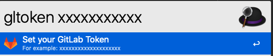
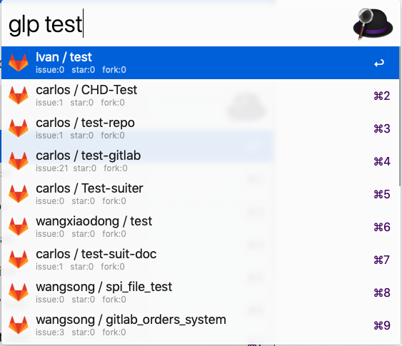
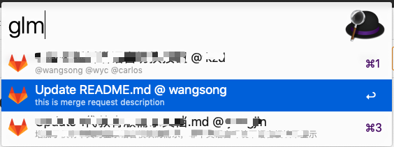
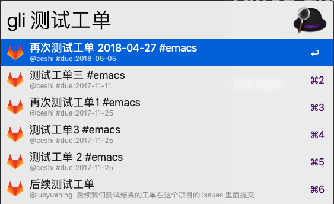
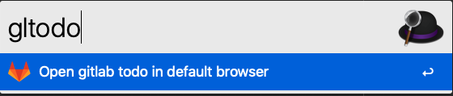

# Alfred Gitlab Tool

Alfred Gitlab dashboard workflow. Navigate projects, issues, merges and todos quickly. 

## Install

- Dependency [Alfred3](https://www.alfredapp.com/)
- Download [the newest Gitlab workflow release](https://github.com/wangshub/Alfred-Gitlab-Tool/releases)
- Click to install.

### Configure

- **`glurl`: Set Gitlab url.**

- **`gltoken`: Set Gitlab token.**

### Feature

- **`glp`: Fuzzy search Gitlab projects.**

- **`glm`: Navigate Gitlab merge requests assigned to you.**

- **`gli`: Search Gitlab issues via API.**

- **`gltodo`: Open Gitlab todos in browser.**

## Question

All pull requests, issues and ideas are welcome.

## Thanks

- Inspired by [lukewaite/alfred-gitlab](https://github.com/lukewaite/alfred-gitlab).
- [alfred-workflow](http://www.deanishe.net/alfred-workflow/) Python libary.

## License

MIT @ [github/wangshub](https://github.com/wangshub)