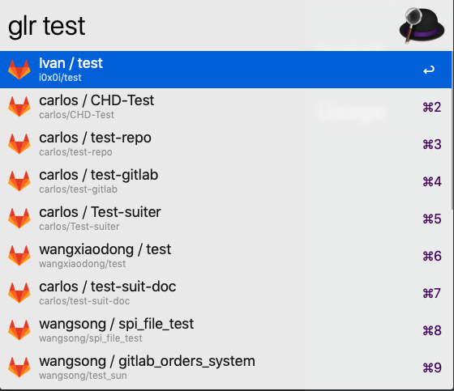

# Alfred Gitlab Tool

When I want to search gitlab projects in Alfred quickly, I found [lukewaite/alfred-gitlab](https://github.com/lukewaite/alfred-gitlab). But it can not work... So I fixed some bugs and add more features.

## Install

Download [workflow release](https://github.com/wangshub/Alfred-Gitlab-Tool/releases)

### Configure

- `glurl`: Set Gitlab url.

- `gltoken`: Set Gitlab token.

### Feature

- `glp`: Fuzzy search Gitlab projects.

- `gli`: Search Gitlab issues via API.

- `gltodo`: Open Gitlab todos in browser.

## Thanks

- Inspired by [lukewaite/alfred-gitlab](https://github.com/lukewaite/alfred-gitlab).
- [alfred-workflow](http://www.deanishe.net/alfred-workflow/) python libary.

## License

MIT @ [github/wangshub](https://github.com/wangshub)